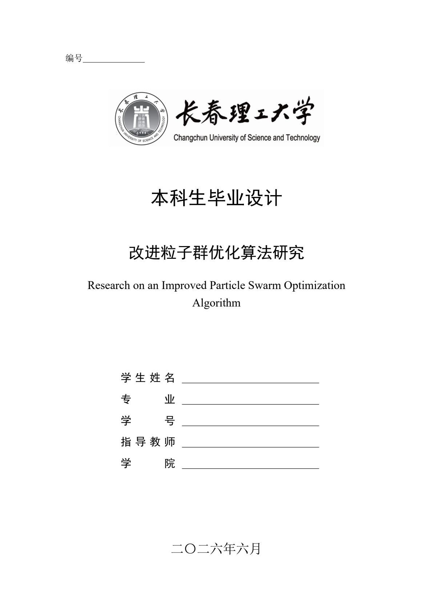
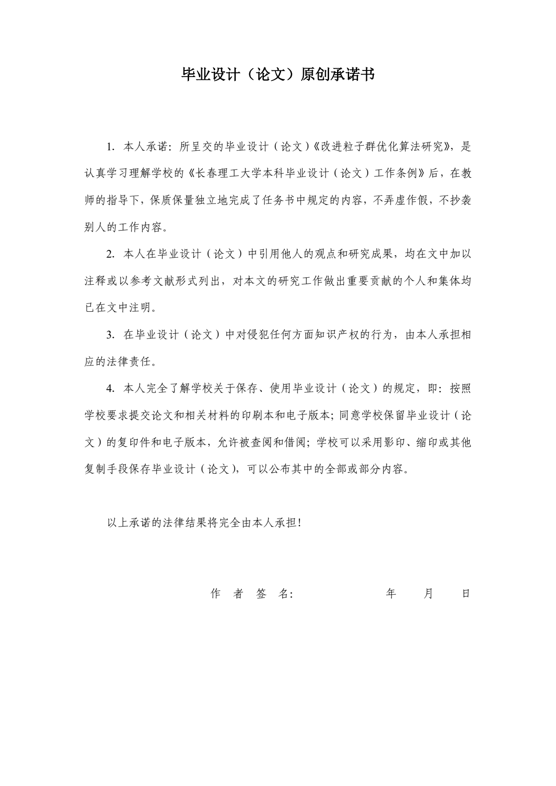
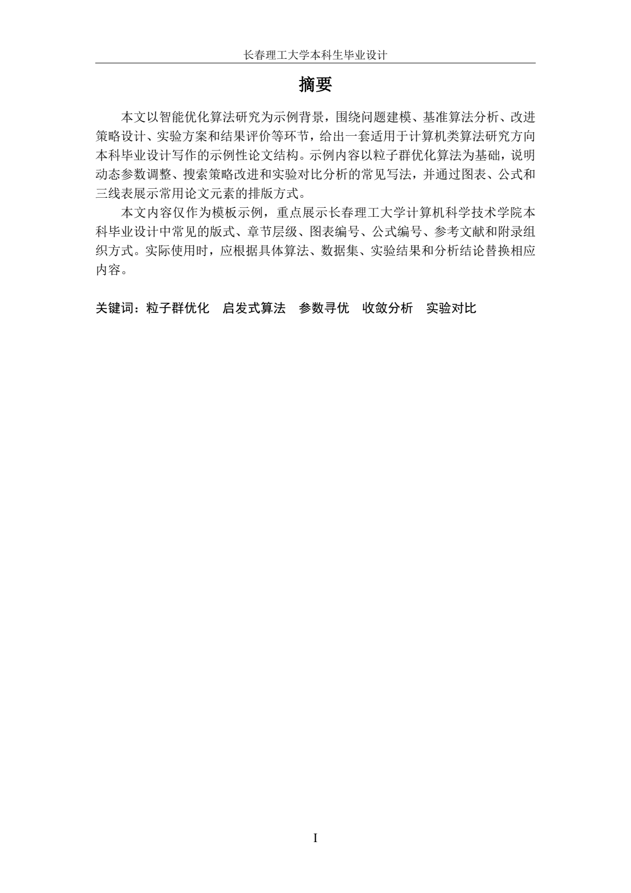
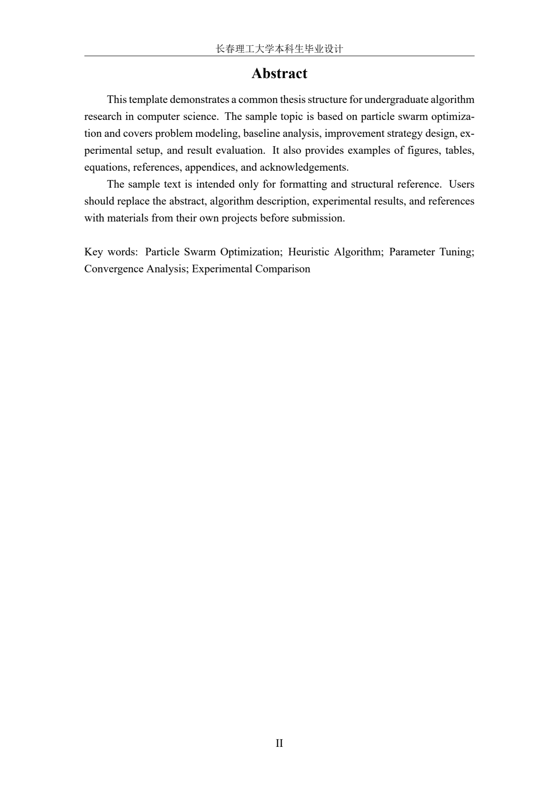
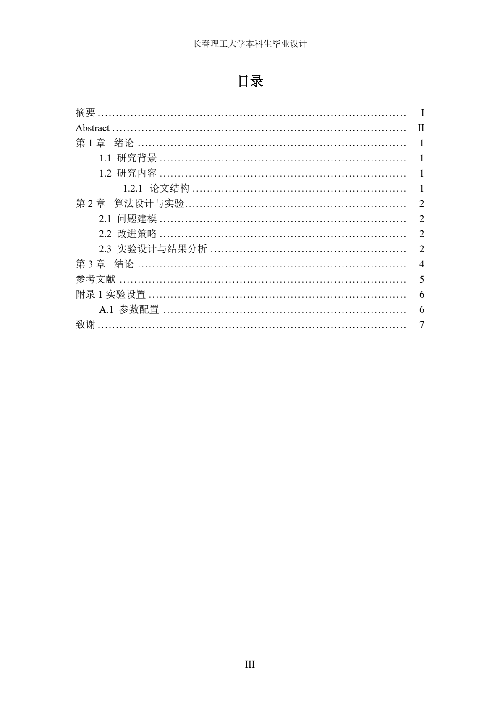
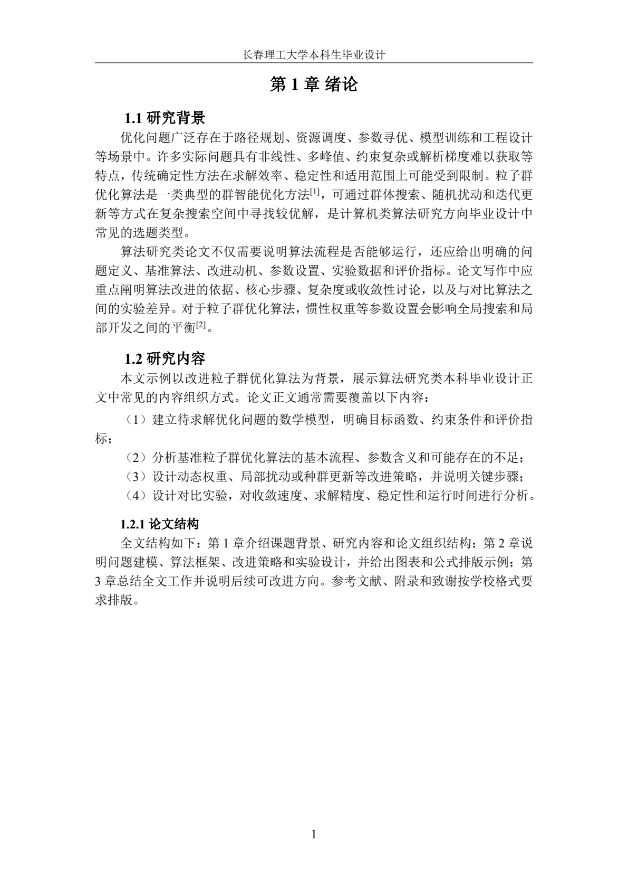
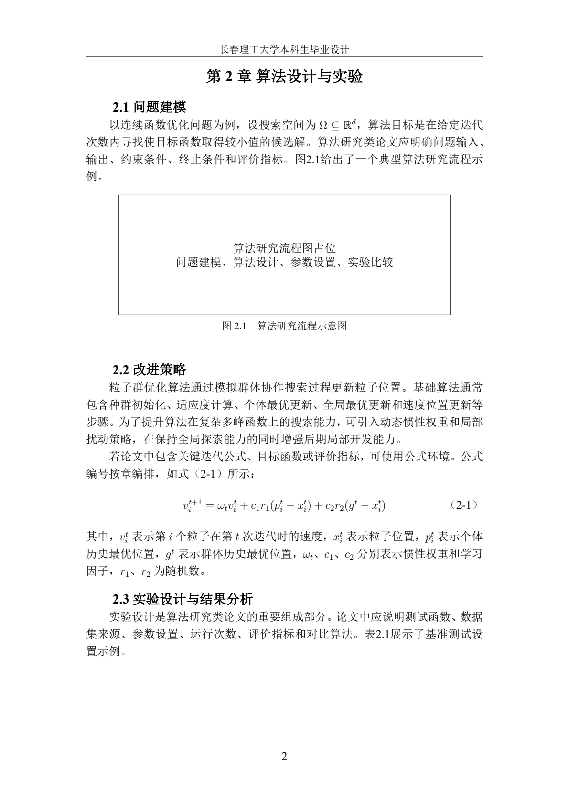
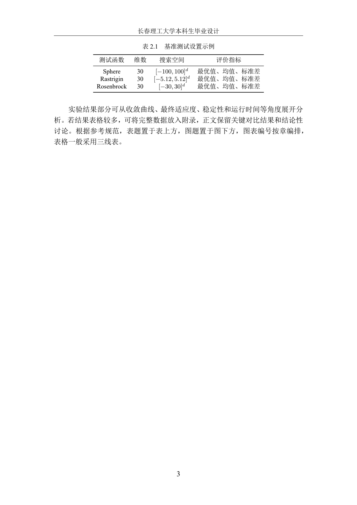
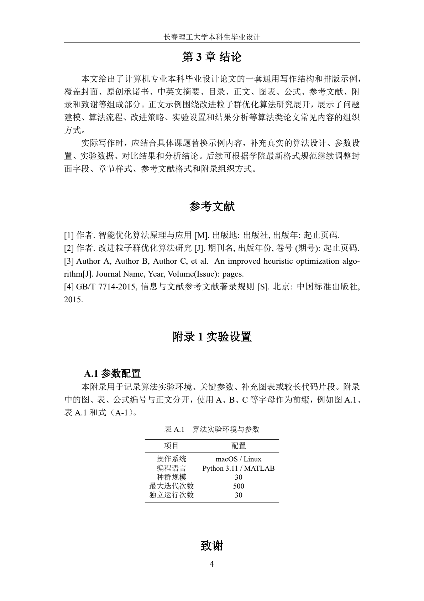

# CustThesis

长春理工大学本科生毕业设计 LaTeX 模板。

本项目为非官方开源模板，使用前请以学校、学院当年发布的最新格式要求为准。
模板中的示例段落、题目和参考文献条目均为通用示例内容，便于演示、开源发布和二次修改。

若发现问题，请提交Issue，欢迎Pull Request。


## 特性

- 支持封面、原创承诺书、中英文摘要、目录、正文、标题、图表、公式、参考文献、附录和致谢。
- 使用 XeLaTeX 编译，兼容本地 TeX Live、Tectonic 和 Overleaf。
- 字体从 `fonts/sim/` 目录读取，便于在不同环境中复现格式。

## 文件结构

- `custhesis.cls`：模板类文件，包含页面、字体、标题、页眉页脚、摘要、目录、图表、公式、参考文献、附录和致谢格式。
- `main.tex`：论文模板入口，使用时替换题目信息、摘要、正文和参考文献。
- `chapters/`：正文各章示例。
- `appendices/`：附录示例。
- `figures/`：图片资源，包含封面使用的学校标识图。
- `fonts/sim/`：模板使用的中文字体和 Times New Roman 字体文件。
- `latexmkrc`：Overleaf/latexmk 使用的 XeLaTeX 编译配置。
- `Makefile`：本地快捷编译和清理命令。

## 编译方式

使用 XeLaTeX：

```bash
xelatex main.tex
xelatex main.tex
```

如果安装了 `latexmk`，也可以使用：

```bash
latexmk -xelatex main.tex
```

也可以直接运行：

```bash
make
```

使用 Tectonic 编译：

```bash
tectonic -X compile -r 1 main.tex
```

## 模板预览

<p>
  <a href="assets/preview/page-01-cover.png"></a>
  <a href="assets/preview/page-02-commitment.png"></a>
  <a href="assets/preview/page-03-abstract.png"></a>
  <a href="assets/preview/page-04-english-abstract.png"></a>
  <a href="assets/preview/page-05-toc.png"></a>
</p>

<p>
  <a href="assets/preview/page-06-chapter-1.png"></a>
  <a href="assets/preview/page-07-chapter-2.png"></a>
  <a href="assets/preview/page-08-chapter-2-continued.png"></a>
  <a href="assets/preview/page-09-conclusion.png"></a>
</p>


## 格式映射

- 页面：A4，上下 2.54cm，左右 3.17cm。
- 正文：中文使用 `fonts/sim/` 中的宋体、黑体、仿宋和楷体文件，西文使用 `fonts/sim/` 中的 Times New Roman；1.25 倍行距，首行缩进 2 字符。
- 页眉：封面和原创承诺书不显示；摘要、目录、正文及后续部分显示“长春理工大学本科生毕业设计”，居中并带单线。
- 页码：摘要和目录使用大写罗马数字；正文起使用阿拉伯数字并从 1 开始。
- 标题：章标题宋体三号加粗居中；二级标题宋体四号加粗并缩进 2 字符；三级标题宋体小四加粗并缩进 2 字符。
- 图表：图题置于图下，表题置于表上，均为宋体五号；编号按章编排。
- 公式：按章编号，格式为“（1-1）”。
- 表格：示例使用 `booktabs` 三线表。
- 参考文献：提供手工编号环境 `custbibliography`，编号左对齐，条目按 Word 模板的普通段落式排版，条目格式按 GB/T 7714-2015 书写。


## 字体说明

模板字体统一从 `fonts/sim/` 目录读取：宋体使用 `simsun.ttc`，宋体加粗使用 `simsun.ttc` 仿粗以贴近 Word 效果，黑体使用 `simhei.ttf`，仿宋使用 `FangSong_GB2312.ttf`，楷体使用 `SIMKAI.TTF`，西文使用 Times New Roman 的 `TIMES*.TTF`。模板不再引用 Fandol 字体。

注意：字体文件和学校标识图用于复现论文格式，版权归各自权利人所有，不属于本项目 MIT 授权范围。如果你的使用场景对第三方资源再分发有额外要求，请自行替换或移除 `fonts/sim/` 和 `figures/cust-logo.png` 中的相关文件。

## BibTeX

If this template is useful for your thesis writing, you can cite it with the following BibTeX entry:

```bibtex
@misc{custthesis,
  author       = {Xinyu Yang},
  title        = {CustThesis: Changchun University of Science and Technology Undergraduate Thesis LaTeX Template},
  year         = {2026},
  howpublished = {\url{https://github.com/shipinboluo/CustThesis}},
  note         = {LaTeX template for CUST undergraduate thesis writing}
}
```

## License

The LaTeX template source code and documentation are released under the MIT License. See [LICENSE](LICENSE).

Fonts, the university logo, and other third-party assets are not covered by the MIT License. Their use and redistribution should follow the license terms of the respective rights holders.
